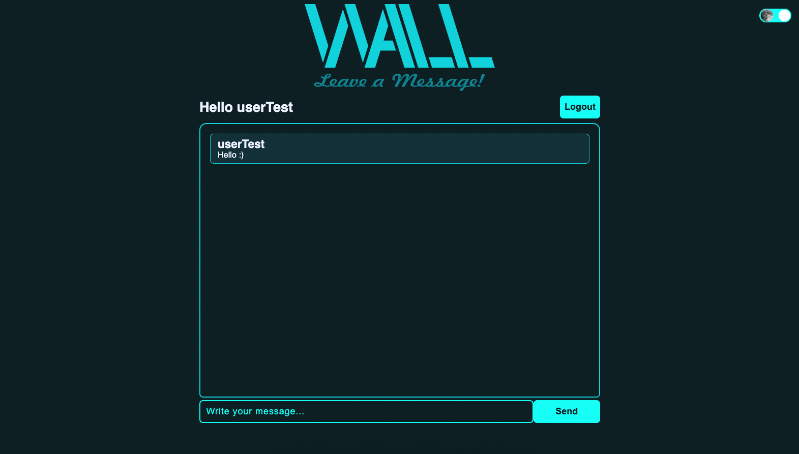

# WALL APP - BACKEND

### Frontend Link
- [Wall-Frontend](https://github.com/mpessini/wall-frontend)

## About



In this project users can create a new account, sign in or enter as a visitor. Users can create a post on a wall if they are logged, or just read the posts, if they aren't.
This project was built using [Django](https://www.djangoproject.com/), [Django Rest Framework](https://www.django-rest-framework.org/) and [JWT](https://jwt.io/).

## Installation

To run this application, open the terminal in any directory of your choice and run the commands below:

1. Clone the project
```bash
git clone git@github.com:mpessini/wall-backend.git
```

2. Enter in project directory
```bash
cd wall-backend
```

3. Create a virtual environment
```bash
python3 -m venv env
```

4. Active the virtual environment
- Linux/MacOs
```bash
source env/bin/activate
```
- Windows
```bash
env\Scripts\activate
```

5. Install project requirements
```bash
pip install -r requirements.txt
```

6. Create your environment file using `.env.example` as an example
- The `.env.exemple` was configurated to send email only on console, if you want to send real emails, change `EMAIL_BACKEND` value to `django.core.mail.backends.smtp.EmailBackend`

7. Create project migrations
```bash
python manage.py makemigrations
```
```bash
python manage.py migrate
```

8. Run the project
```bash
python manage.py runserver
```

## Tests
- To run tests, you need to run the command below
```bash
python manage.py test
```

## Contacts
* [Marcelo Pessini](mailto:marceloppessini@gmail.com)
* [Linkedin](https://www.linkedin.com/in/marcelopessini/)

## Thank you TSL
- This was my first time using Django, I enjoyed learning about this technology.
